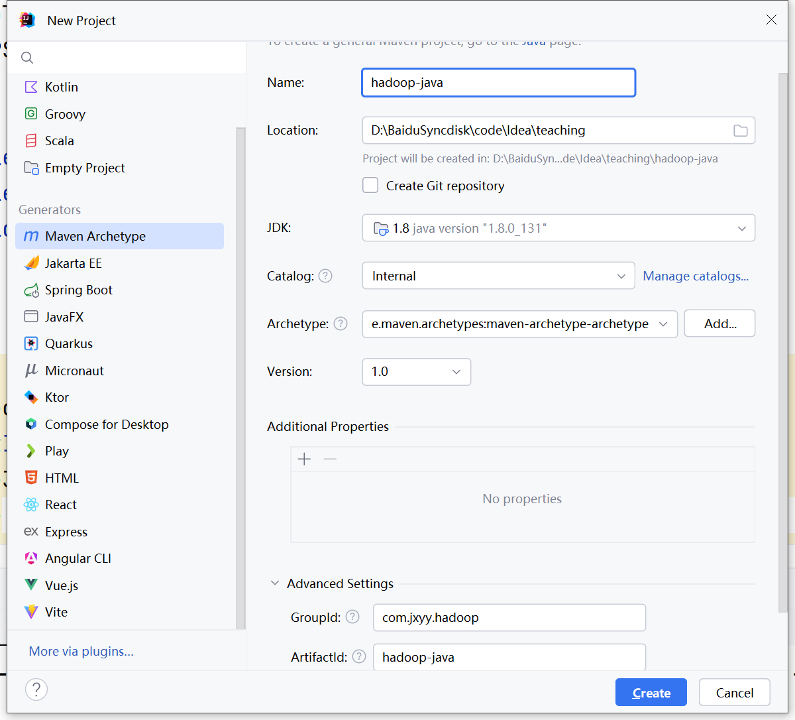

# 006-JavaAPI开发环境

HDFS在生产应用中主要是Java客户端的开发，其核心步骤是从HDFS提供的API中构造一个HDFS的访问客户端对象然后通过该客户端对象操作(增删改查)HDFS上的文件。

## 一、前提条件

- 完成伪分布式搭建

## 二、环境配置

- Idea开发工具
- apache-maven-3.6.0
- Java 8

打开Idea，新建maven工程项目，项目名称为hadoop-java，java版本选择1.8，groupId填写com.jxyy.hadoop,点击创建



工程创建完成后先配置本地maven。

配置完成后修改pom.xml文件添加依赖，hadoop的java接口的核心依赖有三个，分别为：

- hadoop-common
- hadoop-hdfs
- hadoop-client

同时我们引入单元测试模块junit。完整pom.xml文件如下

```xml
<?xml version="1.0" encoding="UTF-8"?>
<project xmlns="http://maven.apache.org/POM/4.0.0"
         xmlns:xsi="http://www.w3.org/2001/XMLSchema-instance"
         xsi:schemaLocation="http://maven.apache.org/POM/4.0.0 http://maven.apache.org/xsd/maven-4.0.0.xsd">
    <modelVersion>4.0.0</modelVersion>

    <groupId>com.jxyy.hadoop</groupId>
    <artifactId>example-hdfs</artifactId>
    <version>1.0-SNAPSHOT</version>

    <properties>
        <maven.compiler.source>8</maven.compiler.source>
        <maven.compiler.target>8</maven.compiler.target>
        <project.build.sourceEncoding>UTF-8</project.build.sourceEncoding>
    </properties>

    <dependencies>
        <dependency>
            <groupId>org.apache.hadoop</groupId>
            <artifactId>hadoop-common</artifactId>
            <version>3.1.4</version>
        </dependency>
        <dependency>
            <groupId>org.apache.hadoop</groupId>
            <artifactId>hadoop-hdfs</artifactId>
            <version>3.1.4</version>
        </dependency>
        <dependency>
            <groupId>org.apache.hadoop</groupId>
            <artifactId>hadoop-client</artifactId>
            <version>3.1.4</version>
        </dependency>
        
        <dependency>
            <groupId>junit</groupId>
            <artifactId>junit</artifactId>
            <version>4.12</version>
            <scope>test</scope>
        </dependency>
    </dependencies>
</project>
```

修改完成后刷新maven工程，检查依赖是否导入。

导入成功后新建以下三个目录：

- src/main/java
- src/main/resource
- src/test/java

并在src/test/java中新建包com.jxyy，在该包下新建Java类GettingStart

```java
package com.jxyy;

import org.apache.hadoop.conf.Configuration;
import org.apache.hadoop.fs.FileSystem;
import org.junit.After;
import org.junit.Before;

import java.io.IOException;

public class GettingStart {
    // 创建配置对象
    private Configuration conf;
    // 创建FileSystem对象
    private FileSystem fs;

    @Before
    public void connectHDFS() throws IOException {
        /**
         * 连接hdfs
         */
        conf = new Configuration();
        // 设置文件系统操作的对象为hdfs，并配置连接地址,此处填写自己服务器的公网ip地址
        conf.set("fs.defaultFS", "hdfs://服务器公网ip:8020/");

        fs = FileSystem.get(conf);
    }

    @After
    public void closeHDFS() throws IOException {
        /**
         * 关闭hdfs连接
         */
        fs.close();
    }
}

```

Hadoop在Java API中有两个核心类分别为`Configuration`和`FileSystem`，分别用于hdfs的配置和操作。

在上方代码中可以看到需要使用到服务器的8020端口，因此在后续开发前，需要先在安全组放行8020端口。

## 三、服务端环境配置

修改`/etc/hosts`文件，文件内容修改为仅有以下一行内容

```
10.0.0.11    hadoop01    hadoop01
```

为避免用户权限问题，可以在`/opt/modules/hadoop-3.1.3/etc/hadoop/hdfs-site.xml`文件中加入以下配置，但此配置较为危险，不推荐

```xml
    <property>
        <name>dfs.permissions</name>
        <value>false</value>
    </property>
```

删除`/opt/data/tmp`下的所有文件，然后重新格式化，完成后启动hdfs

```shell
rm -rf /opt/data/tmp/*
su hadoop
hdfs namenode -format
start-dfs.sh
```

