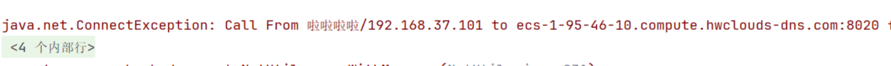

# 008-API开发常见问题

## 问题一



原因：

- hadoop是否启动
- 8020端口是否安全组放行
- 8020端口是否监听外部地址

解决方法：

```shell
# 1. 检查hadoop是否启动
jps  
# 查看是否有namenode和datanode
# 若没有则start-dfs.sh启动
# 2. 检测8020端口是否监听外部地址
netstat -lnt
# 查看:8020前面的ip是否为127.0.0.1
# 若为127.0.0.1则修改/etc/hosts文件，删除启动的127.0.0.1一行后重启hadoop
# 关闭stop-dfs.sh, 启动start-dfs.sh
```

## 问题二

`服务器每次重启过后/etc/hosts文件中自动添加127.0.0.1的域名映射。`

原因：

- 华为云提供的服务，在未配置内网DNS情况下的启动加速。
- 该配置项中`/etc/cloud/cloud.cfg`文件中。

解决方法：

- 将`/etc/cloud/cloud.cfg`文件中的第19行注释掉，如下

- ```
  # manage_etc_hosts:localhost
  ```


## 问题三

`org.apache.hadoop.ipc.RemoteException(java.io.IOException): File /hadoop.txt could only be written to 0 of the 1 minReplication nodes. There are 1 datanode(s) running .. ..`

原因：

- hadoop3中Datanode默认端口为9866端口，9866端口未放行

解决方法：

- 安全组放行9866端口

- ```xml
      <property>
          <name>dfs.client.use.datanode.hostname</name>
          <value>true</value>
      </property>
  ```

- 
