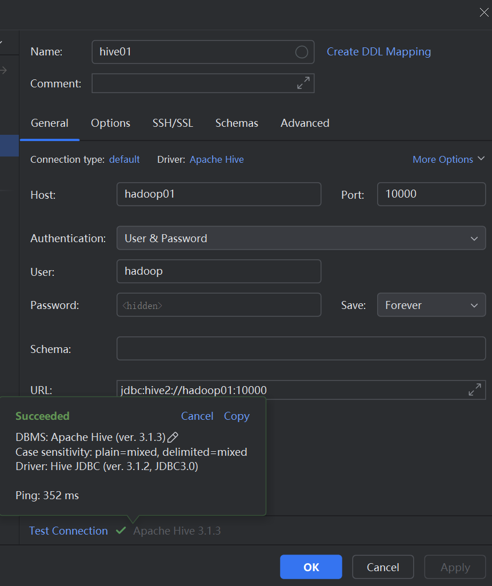
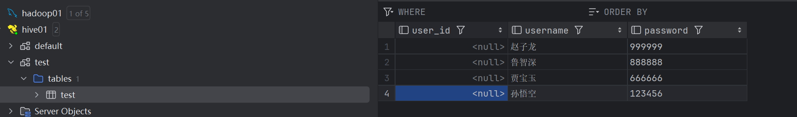

# 013-HiveServer2连接

**Hive提供了第三方连接接口HiveServer2，若需要使用该接口，就需要以HiveServer2的方式启动Hive**

```shell
# 在此之前需要确保hive的metastore服务启动，启动metastore之前要确保mysql启动
nohup bin/hive --service hiveserver2 >> logs/hiveserver2.log 2>&1 &
```

启动后可以通过`lsof -i:10000`检测10000端口是否被监听。Hiveserver2默认使用10000端口通信。

在启动Hiveserver2后，可以通过第三方客户端去连接Hive进行操作，如：

- Beeline ：hive内置客户端，超(`纯`)好(`S`)用(`B`);
- DataGrip：Jetbrains全家桶中的数据库管理工具。(常用，课程使用)
- Navicat：主流数据库管理工具。（常用）

---

**Beeline连接Hive**

```shell
bin/beeline
!connect jdbc:hive2://hadoop01:10000
```

****

**DataGrip连接Hive**

首先需要在服务器安全组放行10000端口

点击左上角加号选择Data Source  --> Apache Hive，配置连接



完成后左侧打开hive01可以看到里面有test库，库里有test表，表中有测试数据。



