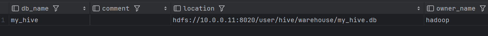

# 014-Hive基本语法

> **Hive的大部分基本语法和SQL一样，但也有一些不同的地方，同时他有一个很个性的名字叫HSQL**

## 一、数据库操作

:squid: 添加数据库

```sql
// 创建数据库, 存在则不创建
create database if not exists my_hive;
// 指定hdfs上的存储路径并创建数据库, 存在则不创建
create database if not exists my_hive2 location '/my_hive2';

// 切换数据库
use my_hive;

// 查看数据库详细信息
desc database my_hive;
desc database my_hive2;

// 修改数据库的存储路径
alter database my_hive set location '/my_hive';
```

Hive中数据库的本质就是hdfs上的文件夹。




:squid: 删除数据库

```sql
// 删除空数据库， 如果有表则会报错
drop database if exists my_hive;
// 强制删除数据库，连表一起删
drop database if exists my_hive2 cascade ;
```

---

## 二、数据表操作

**1. 创建数据表**

```sql
CREATE [EXTERNAL] TABLE [IF NOT EXISTS] table_name 
[(col_name data_type [COMMENT col_comment], ...)] 
[COMMENT table_comment] 
[PARTITIONED BY (col_name data_type [COMMENT col_comment], ...)] 
[CLUSTERED BY (col_name, col_name, ...) 
[SORTED BY (col_name [ASC|DESC], ...)] INTO num_buckets BUCKETS] 
[ROW FORMAT row_format] 
[STORED AS file_format] 
[LOCATION hdfs_path]
```

其中：

- `EXTERNAL` 关键字表示创建外部表。
- `IF NOT EXISTS` 可用于防止表已存在时产生错误。
- `table_name` 是表的名称。
- `col_name` 是列的名称，`data_type` 是**Hive支持的数据类型**，如 `INT`, `STRING`, `DOUBLE` 等。
- `COMMENT` 用于添加列或表的注释。
- `PARTITIONED BY` 用于创建分区表，即将数据物理上分割到不同的分区。
- `CLUSTERED BY` 和 `SORTED BY` 一起用于创建桶表，也就是对列进行哈希分桶。
- `ROW FORMAT` 定义了行如何进行序列化和反序列化。
- `STORED AS` 指定文件的存储格式，如 `TEXTFILE`, `SEQUENCEFILE`, `RCFILE` 或 `ORC`。
- `LOCATION` 指定表在HDFS上的存储位置。

---

**2. Hive支持的数据类型**

| 类型名称      | 描述                             |
| ------------- | -------------------------------- |
| TINYINT       | 1字节的整数                      |
| SMALLINT      | 2字节的整数                      |
| **INT**       | 4字节的整数                      |
| BIGINT        | 8字节的整数                      |
| BOOLEAN       | 布尔类型，true或false            |
| FLOAT         | 单精度浮点数                     |
| **DOUBLE**    | 双精度浮点数                     |
| **STRING**    | 字符串，可以指定字符集           |
| BINARY        | 字节序列                         |
| **TIMESTAMP** | 时间戳，可以指定精度             |
| DECIMAL       | 高精度小数，可以指定精度和规模   |
| CHAR          | 固定长度字符串                   |
| **VARCHAR**   | 可变长度字符串，可以指定最大长度 |
| **DATE**      | 日期类型                         |

除此以外，还支持复杂数据类型：

| 复杂数据类型      | 描述                                                         |
| ----------------- | ------------------------------------------------------------ |
| 数组（Arrays）    | 存储一组具有相同数据类型和名称的变量。可通过索引访问数组中的元素。 |
| 映射（Maps）      | 存储键值对集合，其中每个键映射到一个值。键和值可以是任意数据类型。 |
| 结构体（Structs） | 存储一组具有不同数据类型和名称的变量。类似于数据库中的一行或一个对象。 |
| 联合（Unions）    | 存储不同类型的值，但在任何给定时间只能存储其中一种类型的值。类似于C语言中的联合体。 |

---

**3. 创建一个简单的数据表**

```sql
create database if not exists test;

create table if not exists test.test2
(
    user_id  int,
    username string not null,
    password string not null
);
```


---

**4. 删除数据表**

```sql
drop table test.test2;
```

