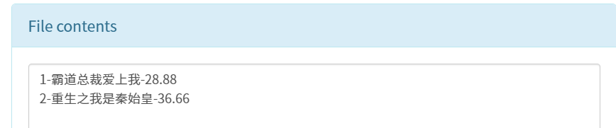

# 015-Hive内部外部表

## 基本知识

Hive的表分类主要包括以下四种：

1. ‌**内部表（管理表）**‌：
   - 数据存储在Hive默认的warehouse目录下。
   - **删除表时，数据和元数据都会被删除**。
2. ‌**外部表**‌：
   - 创建时指定LOCATION，数据存储在HDFS的指定位置。
   - **删除表时，只删除元数据，不删除数据**。
3. ‌**分区表**‌：
   - 用于优化查询，通过分区字段将数据分类存储在不同的目录中。
   - 提高查询效率，常用于按日期等字段分区。
4. ‌**分桶表**‌：
   - 通过哈希取值将数据分桶存储，用于数据抽样和提高特定查询效率。

外部表和内部表在创建表时使用`external`进行区分。

---

## 实验操作

**1.创一个内部表`book`并插入几数据**

```hive
create database if not exists test;

// 简单创建一个内部表
create table if not exists test.book
(
    id        int    not null,
    book_name string not null,
    price     double not null
);

insert into test.book
values (1, '霸道总裁爱上我', 28.88),
       (2, '重生之我是秦始皇', 36.66);

select *
from test.book;
```


在hdfs上查看数据存储位置为`/user/hive/warehouse/test.db/book`


**2. 创建表指定分隔符**

```hive
create table if not exists test.book2
(
    id        int    not null,
    book_name string not null,
    price     double not null
) row format delimited fields terminated by '--';
```

在hdfs上查看数据存储文件`/user/hive/warehouse/test.db/book2/000000_0`是否分隔符为`--`



**3. 删除数据表**

通过删除数据表，检验内部表备删除后是否会将数据全部删除。

```hive
// 删除数据表
drop table test.book;
drop table test.book2;
```

执行后查看hdfs中(`/user/hive/warehouse/test.db`)两个表的数据是否被删除。


查看到数据文件已经被删除

同时可以去hive元数据库**(mysql中的hive数据库)**中**TBLS表**查看是否删除元数据。


查看到只有test表的数据，book和book2表的元数据均被删除。

**4. 创建一张外部表`book_ex`指定存储位置**

```hive
// 创建一张外部表，指定存储在/ext_tb目录
create external table if not exists test.book_ext1
(
    id        int    ,
    book_name string ,
    price     double
)
    row format delimited fields terminated by ','
    location '/ext_tb';
// 查看数据
select *
from test.book_ext1;
```

> 此时需要注意，需要移除掉建表语句中的列约束`not null`
>
> 在 Hive 中，外部表是指数据存储在 Hive 管理之外的文件系统中的表。由于 Hive 不控制外部表数据的生命周期，因此不允许在外部表上定义约束，以防止数据一致性和完整性问题。

此时可以在hdfs上看到新建了`/ext_tb`目录，里面没有任何数据。

新建一个`test_ext.txt`文件，并上传到`/ext_tb`目录下，上传方式自行选择：

- [x]  hdfs-web页面上传；
- [ ] java-api上传；
- [ ] hdfs shell命令上传；

文件内容如下（可自定义，但分隔符依据建表时所指定）

```tex
1,倚天屠龙记,88.88
2,雪中悍刀行,59.90
```


上传完成后再次执行查询语句后查看数据。


删除数据库，检查数据是否被删除。

```hive
// 删除数据库查看数据文件是否被删除
drop table test.book_ext1;
```

在hdfs中可以看到，数据文件并没有被删除。


**5. 先有数据后创建表**

上述操作完成后，在`/ext_tb`目录下已经存在有数据了，此时再新建一张外部表，查看是否可以关联已有数据。

```hive
// 根据现有数据创建外部表
create external table if not exists test.book_ext2
(
    id        int    ,
    book_name string ,
    price     double
)
    row format delimited fields terminated by ','
    location '/ext_tb';
// 查看是否关联数据
select *
from test.book_ext2;
```


## 拓展内容

**内部表和外部表进行转换**

在Hive中，可以通过`describe formatted tablename`命令来查看表信息，在数据结果中找到`tableType`

- managed_table：内部表
- external_table：外部表

内部表（Managed Table）和外部表（External Table）之间的转换是一个相对简单的操作，主要通过修改表的属性来实现。

**外部表转换为内部表**

要将外部表转换为内部表，你可以使用ALTER TABLE语句来更改表的类型。以下是一个示例SQL语句：

```hive
alter table external_table_name set tblproperties  ('EXTERNAL'='TRUE');
```


这个语句将名为external_table_name的外部表转换为内部表。执行此操作后，Hive将开始管理表的数据文件，包括在删除表时删除数据文件。

**内部表转换为外部表**

同样，要将内部表转换为外部表，也可以使用ALTER TABLE语句，但这次是将EXTERNAL属性设置为TRUE：

```hive
alter table managed_table_name set tblproperties  ('EXTERNAL'='TRUE');
```


这个语句将名为managed_table_name的内部表转换为外部表。执行此操作后，Hive将不再管理表的数据文件，删除表时也不会删除数据文件。

注意事项：

- 在进行表类型转换之前，请确保了解转换的后果，特别是关于数据文件的管理。
- 转换表的类型可能会影响表的性能和存储管理。
- 在执行任何结构更改之前，建议备份表和数据。
- 如果你使用的是Hive的较旧版本，请检查文档以确认支持的语法和功能。
