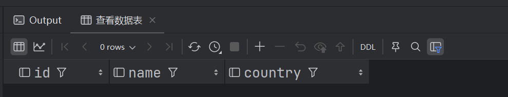
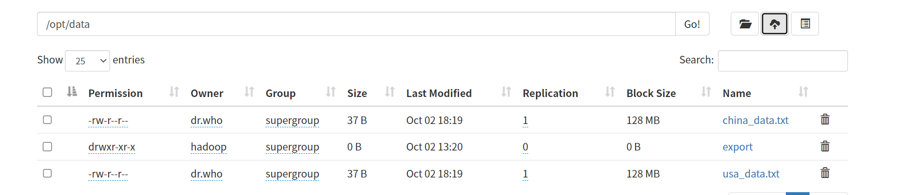
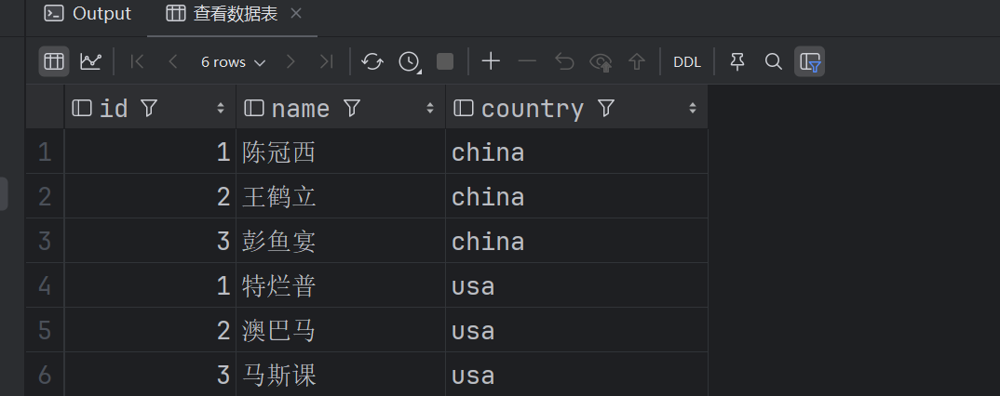
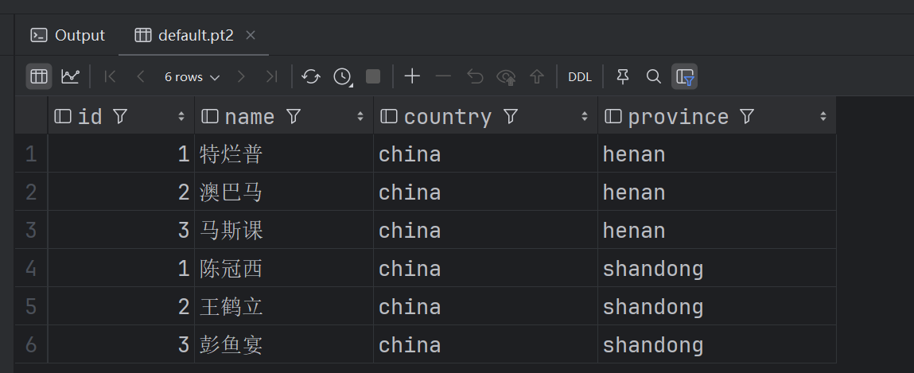
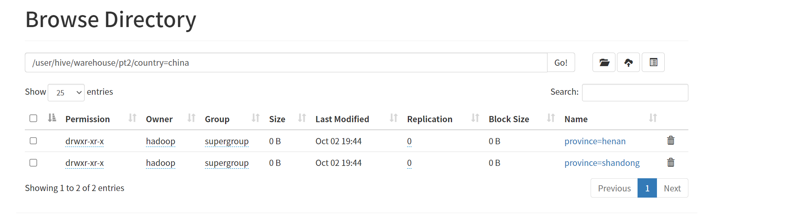
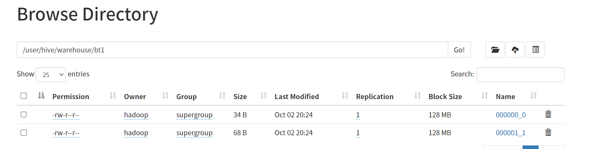
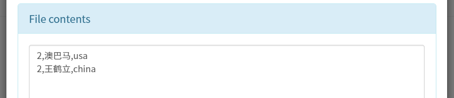
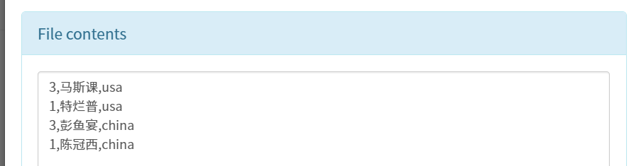

# 016-Hive分区表分桶表

## 基本知识

Hive中的分区表和分桶表是两种不同的数据组织方式，它们在数据管理和查询优化方面各有特点。

- **分区表‌**：主要通过指定的列值进行逻辑划分，每个分区对应HDFS上的一个独立文件夹，便于数据的管理和维护。分区表可以提高查询性能，减少数据扫描量，主要适用于数据的聚合查询和数据分析。创建分区表时，需使用partitioned by子句指定分区字段及其类型‌。
- **分桶表‌**：则是将数据按照某列属性值的hash值均匀分布到多个桶中，每个桶对应一个文件。分桶表可以提高查询效率，减少数据倾斜问题，适用于数据量较大时的查询优化和负载均衡。创建分桶表时，需使用clustered by子句指定分桶字段及桶的个数‌。

---

Hive分区表常见的分区策略主要包括：

**‌按时间分区‌**：如按年、月、日进行分区，适用于日志数据、交易记录等按时间顺序生成的数据。
**‌按地域分区‌**：根据地理位置进行分区，如国家、地区或城市，适用于需要按地理位置分析的数据。
**‌按类别分区‌**：根据业务类别或数据类型进行分区，如产品类别、用户类型等，适用于需要按类别进行数据管理和查询的场景。
**‌组合分区‌**：结合上述多种分区策略，如按时间和地域组合分区，适用于需要同时按多种维度进行数据管理和查询的复杂场景。

这些分区策略可以根据实际业务需求和数据特点灵活选择和组合，以提高数据管理和查询的效率。‌

---

Hive分桶表常见的分桶策略主要包括以下两种：

**‌基于Hash值的分桶‌：**

这种方法是根据分桶字段（列）的hash值除以分桶的个数进行取余，来决定数据应该存储在哪个桶中。
公式为：bucket_id = column.hashcode % bucket.num。
优点是可以加速JOIN操作，特别是在两个表基于同一列进行桶划分，并且桶的数量相同或成倍数关系时，能够在map阶段完成JOIN，显著提高JOIN效率。

**‌考虑分区与分桶结合‌：**

在设计Hive表时，除了分桶，还可以考虑分区策略，根据时间、地区或其他频繁用于筛选的维度，将表划分为多个分区。
分区有助于缩小查询范围，减少IO，提高查询性能。
合理选择分区键和分桶数量是关键，以避免过细的分区导致元数据过多，或分区过粗无法有效减小数据量，以及桶的数量过多导致元数据膨胀或过少失去桶表的优势。

---

## 实验操作

### 分区表

```sql
// 创建一个简单的分区表
create table if not exists pt1
(
    id int,
    name string
)
partitioned by (country string)
row format delimited fields terminated by ',';

// 查看数据表
select *
from pt1;
```

可以看到分区符被当作列存储在表中



准备两个数据文件`china_data.txt`和`china_data.txt`并上传到hdfs的`/opt/data`目录下，内容分别如下

```python
# china_data.txt
1,陈冠西
2,王鹤立
3,彭鱼宴

# usa_data.txt
1,特烂普
2,澳巴马
3,马斯课
```



通过`load data`将数据导入到数据表中

```sql
// 导入hdfs数据并指定分区
load data inpath '/opt/data/china_data.txt' into table pt1 partition (country='china');
load data inpath '/opt/data/usa_data.txt' into table pt1 partition (country='usa');

// 查看数据表
select *
from pt1;
```

导入成功得到结果



在hdfs查看`/user/hive/warehouse/pt1`目录下可以看到创建了`country=china`、`country=usa`两个文件夹。

**多级分区**

创建一个多级分区表

```sql
// 创建一个多级分区表
create table if not exists pt2
(
    id int,
    name string
)
partitioned by (country string, province string)
row format delimited fields terminated by ',';
```

重新上传导入数据，此时需要指定两个分区

```sql
// 重新上传导入数据，此时需要指定两个分区
load data inpath '/opt/data/china_data.txt' into table pt2 partition (country='china', province='shandong');
load data inpath '/opt/data/usa_data.txt' into table pt2 partition (country='china', province='henan');
```

查看数据表

```sql
select * from pt2;
```



hdfs上查看文件分区，在country=china下有两个目录




### 分桶表

创建一个简单的分桶表

```sql
create table bt1 (
    id int,
    name string,
    country string
) clustered by (id) into 2 buckets ;
```

插入数据，在分桶表中，由于hash算法和load data机制原因，不能使用load data导入数据， 需要使用 insert into .. select插入数据，因此先查询表pt1，然后将查询结果数据导入到bt1表。

```sql
// 插入数据，不支持load data
insert into table bt1 select * from pt1;
```

此时在hdfs上查看数据表bt1的目录下有两个文件



其中id为偶数的数据存放在第一个文件，id为基数的数据存放在第二个文件。






