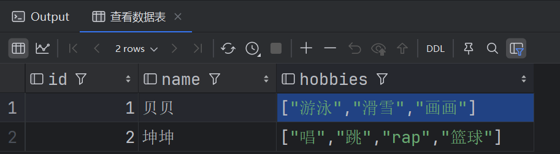
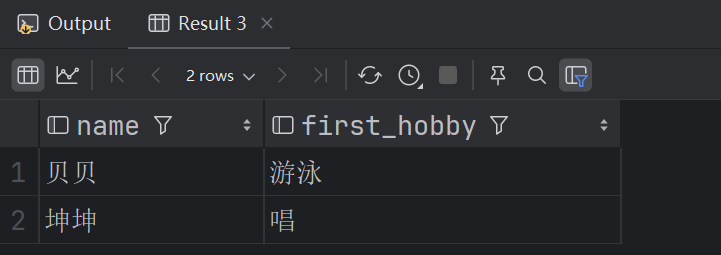
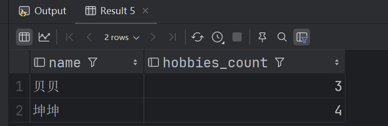
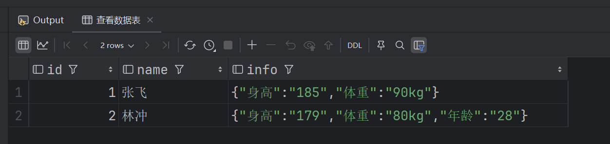

# 018-Hive复杂数据类型

Hive中复杂数据类型涉及四类

| 复杂数据类型      | 描述                                                         |
| ----------------- | ------------------------------------------------------------ |
| 数组（Arrays）    | 存储一组具有相同数据类型和名称的变量。可通过索引访问数组中的元素。 |
| 映射（Maps）      | 存储键值对集合，其中每个键映射到一个值。键和值可以是任意数据类型。 |
| 结构体（Structs） | 存储一组具有不同数据类型和名称的变量。类似于数据库中的一行或一个对象。 |
| 联合（Unions）    | 存储不同类型的值，但在任何给定时间只能存储其中一种类型的值。类似于C语言中的联合体。 |

学习过程中要求掌握前两类，后两类仅做了解。


## 数组（Arrays）

类似于Java中的数组，  存储一组具有相同数据类型和名称的变量。可通过索引访问数组中的元素。

### 准备测试数据

创建`array_data.txt`文件并上传到`hdfs的/opt/data`目录下，内容如下

```tex
1,贝贝,游泳|滑雪|画画
2,坤坤,唱|跳|rap|篮球
```

### 创建表

新建一张数据表array_table，将爱好列设置为数组类型，指定数据分隔符为`,`  ，数组元素分隔符为`|`

```sql
// 创建一张含有数组类型的数据表并指定分隔符
create table array_table
(
    id integer,
    name string,
    hobbies array<string>
) row format delimited fields terminated by ','
collection items terminated by '|';
```

### 导入上传的数据

```sql
// 导入数据
load data inpath '/opt/data/array_data.txt' into table array_table;

// 查看数据表
select *
from array_table;
```



### 常用操作

数组索引取值以及查看数组长度

```sql
//数组索引取值
select name, hobbies[0] as first_hobby from array_table;
```



```sql
//查看数组长度
select name, size(hobbies) as hobbies_count from array_table;
```



判断数组中是否存在元素

```sql
// 判断数组中是否存在元素
select *
from array_table
where array_contains(hobbies, '篮球');
```


## 映射（Maps）

类似Java中的map<>集合，以`key: value`形式的储数据结构。

### 准备测试数据

创建`map_data.txt`文件并上传到`hdfs的/opt/data`目录下，内容如下

```tex
1,张飞,身高:185|体重:90kg
2,林冲,身高:179|体重:80kg|年龄:28
```

### 创建表

新建一张数据表map_table，将信息列设置为map类型，指定数据分隔符为`,`  ，元素分隔符为`|`， map的分隔符为`:`

```sql
// 导入数据
load data inpath '/opt/data/map_data.txt' into table map_table;

// 查看数据表
select *
from map_table;
```



## 常用操作

```sql
// 根据key取值
select name, info['身高'] as height from map_table;

// 查看元素个数(k-v对的格式)
select name, size(info) as infos
from map_table;

// 查看所有key， 所有value
select name, map_keys(info) as keys
from map_table;

select name, map_values(info) as vs
from map_table;

// 判断key是否存在，参考数组
select name, info['年龄'] as age
from map_table
where array_contains(map_keys(info), '年龄');

```

