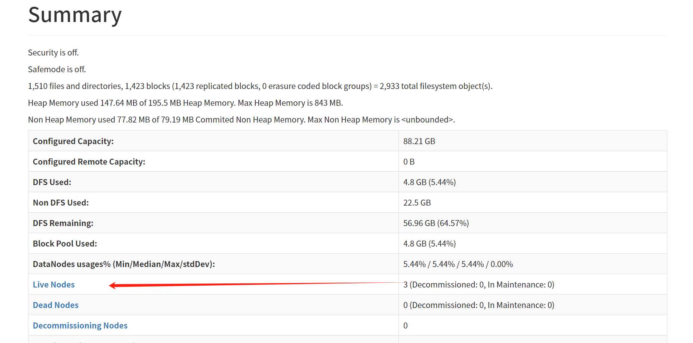
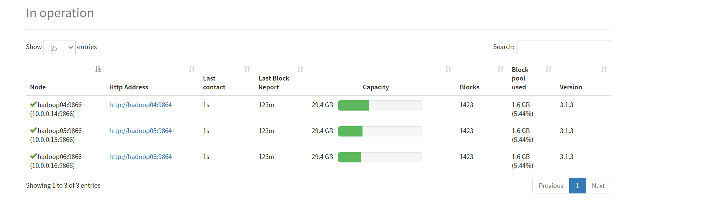

# 021-完全分布式搭建

## 一、前提条件

- hadoop01完成伪分布式搭建
- hadoop01完成伪分布式yarn的配置和部署
- 完成zookeeper高可用集群搭建

## 二、环境准备

- 华为云加购云服务器2台
- 虚拟私有云手动分配ip分别为10.0.0.12和10.0.0.13
- 服务器名称分别为hadoop02和hadoop03

## 三、节点分配

|        hadoop01        |     hadoop02      |     hadoop03      |
| :--------------------: | :---------------: | :---------------: |
|       `namenode`       |    `namenode`     |                   |
|    datanodedatanode    |     datanode      |     datanode      |
|                        | `resourcemanager` | `resourcemanager` |
| nodemanagernodemanager |    nodemanager    |    nodemanager    |

在搭建Hadoop 3 HA（High Availability），通常需要以下步骤：

1. 配置ZooKeeper集群用于管理HDFS的HA状态。
2. 配置两个NameNode为active和standby状态。
3. 配置ResourceManager为active和standby状态。
4. 配置其他相关服务（如QuorumPeerMain、DataNode、NodeManager等）。

## 四、配置文件修改

完成hadoop的高可用分布式集群配置一种需要配置5个文件

- core-site.xml
- hdfs-site.xml
- mapred-site.xml
- yarn-site.xml
- workers

1.修改core-site.xml文件，完整配置如下

```xml
<configuration>
        <!-- hdfs地址,ha中是连接到nameservice -->
    <property>
        <name>fs.defaultFS</name>
        <value>hdfs://mycluster</value>
    </property>

    <!-- 指定hadoop数据的存储目录 -->
    <property>
        <name>hadoop.tmp.dir</name>
        <value>/opt/data/tmp</value>
    </property>

    <!-- 故障转移 -->
    <property>
        <name>ha.zookeeper.quorum</name>
        <value>hadoop01:2181,hadoop02:2181,hadoop03:2181</value>
    </property>


    <!-- hive用户代理 -->
    <property>
        <name>hadoop.proxyuser.hadoop.hosts</name>
        <value>*</value>
    </property>
    <property>
        <name>hadoop.proxyuser.hadoop.groups</name>
        <value>*</value>
    </property>
</configuration>
```

2.修改hdfs-site.xml文件，完整配置如下

```xml
<configuration>
    <property>
        <name>dfs.replication</name>
        <value>3</value>
    </property>
        <!-- 新增ha配置内容 -->
    <property>
        <name>dfs.nameservices</name>
        <value>mycluster</value>
    </property>
    <property>
        <name>dfs.ha.namenodes.mycluster</name>
        <value>nn1,nn2</value>
    </property>
    <property>
        <name>dfs.namenode.rpc-address.mycluster.nn1</name>
        <value>hadoop01:8020</value>
    </property>
    <property>
        <name>dfs.namenode.rpc-address.mycluster.nn2</name>
        <value>hadoop02:8020</value>
    </property>
    <!-- 修改为两个namenode的web页面地址 -->
    <property>
        <name>dfs.namenode.http-address.mycluster.nn1</name>
        <value>hadoop01:9870</value>
    </property>
        <property>
        <name>dfs.namenode.http-address.mycluster.nn2</name>
        <value>hadoop02:9870</value>
    </property>
        <!-- 客户端连接可用状态的NameNode所用的代理类 -->
    <property>
        <name>dfs.client.failover.proxy.provider.mycluster</name>
        <value>org.apache.hadoop.hdfs.server.namenode.ha.ConfiguredFailoverProxyProvider</value>
    </property>
     <!-- namenode间用于共享编辑日志的journal节点列表 -->
    <property>
        <name>dfs.namenode.shared.edits.dir</name>
        <value>qjournal://hadoop01:8485;hadoop02:8485/mycluster</value>
    </property>
        <!-- journalnode 上用于存放edits日志的目录 -->
    <property>
        <name>dfs.journalnode.edits.dir</name>
        <value>/opt/modules/hadoop-3.1.3/jn/data</value>
    </property>
    <!--sshfence：防止namenode脑裂，当脑裂时，会自动通过ssh到old-active将其杀掉，将standby切换为active  -->
    <property>
        <name>dfs.ha.fencing.methods</name>
        <value>sshfence</value>
    </property>
    <!-- 故障转移设置为ture -->
    <property>
        <name>dfs.ha.automatic-failover.enabled</name>
        <value>true</value>
    </property>
    <!-- 取消权限认证(危险，慎用！)   -->
    <property>
        <name>dfs.permissions</name>
        <value>false</value>
    </property>
</configuration>
```

3.修改mapred-site.xml文件，完整配置如下

```xml
<configuration>
    <property>
        <name>mapreduce.framework.name</name>
        <value>yarn</value>
    </property>
    <property>
        <name>yarn.app.mapreduce.am.env</name>
        <value>HADOOP_MAPRED_HOME=$HADOOP_HOME</value>
    </property>
    <property>
        <name>mapreduce.map.env</name>
        <value>HADOOP_MAPRED_HOME=$HADOOP_HOME</value>
    </property>
    <property>
        <name>mapreduce.reduce.env</name>
        <value>HADOOP_MAPRED_HOME=$HADOOP_HOME</value>
    </property>

    <!--设置mapreduce的历史服务器安装在bigdata007节点上-->
    <property>
        <name>mapreduce.jobhistory.address</name>
        <value>hadoop01:10020</value>
    </property>
    
    <!--设置历史服务器的web页面地址和端口号-->
    <property>
        <name>mapreduce.jobhistory.webapp.address</name>
        <value>hadoop01:19888</value>
    </property>
    
     <!--任务内存配置(可选)-->
    <property>
　    　<name>mapreduce.map.memory.mb</name>
　　    <value>1536</value>
    </property>
    <property>
　　    <name>mapreduce.map.java.opts</name>
　　    <value>-Xmx1024M</value>
    </property>
    <property>
　　    <name>mapreduce.reduce.memory.mb</name>
　　    <value>1536</value>
    </property>
    <property>
　　    <name>mapreduce.reduce.java.opts</name>
　　    <value>-Xmx1024M</value>
    </property>
</configuration>
```

4.修改yarn-site.xml文件，完整配置如下

```xml
<configuration>

  <!-- 配置yarn的默认混洗方式，选择为mapreduce的默认混洗算法 -->
  <property>
    <name>yarn.nodemanager.aux-services</name>
    <value>mapreduce_shuffle</value>
  </property>

  <!-- 是否启用日志聚集功能 -->
  <property>
    <name>yarn.log-aggregation-enable</name>
    <value>true</value>
  </property>

  <!-- 是配置聚集的日志在HDFS上最多保存多长时间 -->
  <property>
    <name>yarn.log-aggregation.retain-seconds</name>
    <value>106800</value>
  </property>

  <!--  启用resourcemanager的ha功能 -->
  <property>
    <name>yarn.resourcemanager.ha.enabled</name>
    <value>true</value>
  </property>

  <!--  为resourcemanage ha集群起个id -->
  <property>
    <name>yarn.resourcemanager.cluster-id</name>
    <value>yarn-cluster</value>
  </property>
    
  <!--  指定resourcemanger ha有哪些节点名 -->
  <property>
    <name>yarn.resourcemanager.ha.rm-ids</name>
    <value>rm1,rm2</value>
  </property>

  <!--  指定第一个节点的所在节点 -->
  <property>
    <name>yarn.resourcemanager.hostname.rm1</name>
    <value>hadoop02</value>
  </property>
  <property>
    <name>yarn.resourcemanager.webapp.address.rm1</name>
    <value>hadoop02:8088</value>
  </property>

  <!--  指定第二个节点所在机器 -->
  <property>
    <name>yarn.resourcemanager.hostname.rm2</name>
    <value>hadoop03</value>
  </property>
  <property>
    <name>yarn.resourcemanager.webapp.address.rm2</name>
    <value>hadoop03:8088</value>
  </property>

  <!-- 指定resourcemanger ha所用的zookeeper节点 -->
  <property>
    <name>yarn.resourcemanager.zk-address</name>
    <value>hadoop01:2181,hadoop02:2181,hadoop03:2181</value>
  </property>
  <!-- 开启Recovery后，ResourceManger会将应用的状态等信息保存到yarn.resourcemanager.store.class配置的存储介质中，重启后会load这些信息，并且NodeManger会将还在运行的container信息同步到ResourceManager，整个过程不影响作业的正常运行。 -->
  <property>
    <name>yarn.resourcemanager.recovery.enabled</name>
    <value>true</value>
  </property>

 <!-- 指定yarn.resourcemanager.store.class的存储介质(HA集群只支持ZKRMStateStore) -->
  <property>
    <name>yarn.resourcemanager.store.class</name>
    <value>org.apache.hadoop.yarn.server.resourcemanager.recovery.ZKRMStateStore</value>
  </property>
  <property>
      <name>yarn.application.classpath</name>
      <value>/opt/modules/hadoop-3.1.3/etc/hadoop:/opt/modules/hadoop-3.1.3/share/hadoop/common/lib/*:/opt/modules/hadoop-3.1.3/share/hadoop/common/*:/opt/modules/hadoop-3.1.3/share/hadoop/hdfs:/opt/modules/hadoop-3.1.3/share/hadoop/hdfs/lib/*:/opt/modules/hadoop-3.1.3/share/hadoop/hdfs/*:/opt/modules/hadoop-3.1.3/share/hadoop/mapreduce/lib/*:/opt/modules/hadoop-3.1.3/share/hadoop/mapreduce/*:/opt/modules/hadoop-3.1.3/share/hadoop/yarn:/opt/modules/hadoop-3.1.3/share/hadoop/yarn/lib/*:/opt/modules/hadoop-3.1.3/share/hadoop/yarn/*</value>
  </property>
</configuration>
```

5.在hadoop/etc/hadoop目录下创建workers文件，内容如下

```shell
vim /opt/modules/hadoop-3.1.3/etc/hadoop/workers
# 写入以下内容
hadoop01
hadoop02
hadoop03
```


## 五、集群分发

将配置的haodoop和jdk8分发到另外两台机器上

```shell
# hadoop发送
cd /opt/modules
scp -r /opt/modules/hadoop-3.1.3/ hadoop02:/opt/modules/hadoop-3.1.3/
scp -r /opt/modules/hadoop-3.1.3/ hadoop03:/opt/modules/hadoop-3.1.3/
# jdk8发送
scp -r /opt/modules/jdk8/ hadoop02:/opt/modules/jdk8/
scp -r /opt/modules/jdk8/ hadoop03:/opt/modules/jdk8/

# 发送opt下的data目录
scp -r /opt/data/ hadoop02:/opt
scp -r /opt/data/ hadoop03:/opt
```

检查modules和data目录是否为hadoop所有，如果不是修改为hadoop所有

```shell
chown -R hadoop:hadoop /opt/modules
chown -R hadoop:hadoop /opt/data
```

## 六、格式化

在所有机器上启动journalnode

```shell
hdfs --daemon start journalnode
```

所有节点启动zookeeper

```shell  
# 脚本一键启动，没脚本的看笔记020
zkctl.sh start
# 查看zookeeper集群状态
zkctl.sh status
```

在任意一个部署namenode节点的机器上(hadoop01或hadoop02)上格式化hdfs

```shell
hdfs namenode -format
```

> 此处若格式化失败，尝试删除/opt/data/tmp下的所有内容，然后重新格式化

在格式化好的节点机器上启动namenode

```shell
hdfs --daemon start namenode
```

在另外一台未格式化namenode的机器上同步namenode信息

```shell
hdfs namenode -bootstrapStandby
```

同步完成后在该机器上启动namenode

```shell
hdfs --daemon start namenode
```


## 七、启动HA集群

在任意一台机器上以hadoop用户启动集群

```shell
start-dfs.sh  #启动dfs
start-yarn.sh #启动yarn
#  也可以直接start-all.sh方式启动，但官方不推荐
```

启动完成使用`jps`命令查看个台机器节点数(参考表格)是否有问题，如有节点数有问题则去查看日志进行排错。

```shell
hadoop01上要有 nn dn nm
hadoop02上要有 nn dn rm nm
hadoop03上要有 dn rm nm
```

确认节点无误后，浏览器分别打开hadoop01和hadoop02的9870页面，可以看到一个是`active`  一个上`standby`，

同时在页面的Live Nodes中可以看到存活节点为3



同时导航栏点击DataNodes选项卡，可以看到三个DataNode节点



此时，基于Zookeeper的Hadoop + Yarn高可用分布式集群搭建完成。


