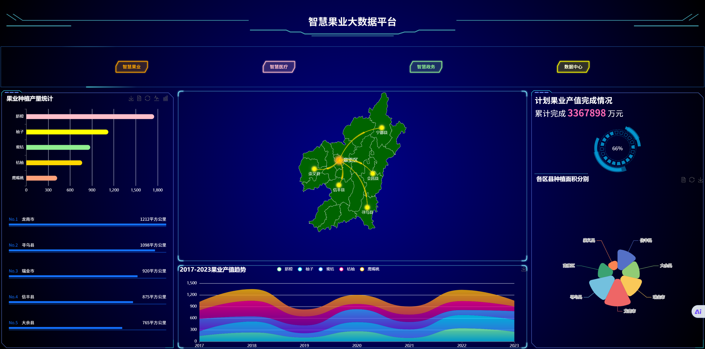

# 101-案例介绍：果业大数据数仓

根据果业大数据平台信息生成大数据数仓，并形成可视化。

前提条件：

- 完成Hadoop安装部署(分布式或伪分布式)
- 完成Hive的安装部署

前置课程：

- Hadoop开发与应用
- Java EE

开发工具：

- IDEA
- DataGrip / Navicat
- WebStorm / VsCode
- Python / PyCharm  （非必要）